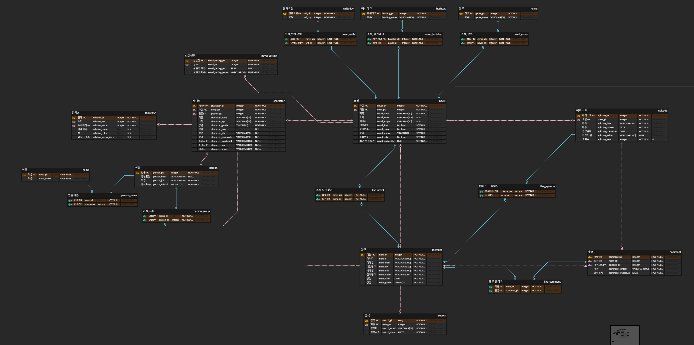

# [Project3] Episode
> 웹 에디터 기반 소설 작성 플랫폼 :: 에피소드

<p align="center"> </p>

<a href="http:k02a2061.p.ssafy.io" target="_blank"> Demo link </a>

## Project Info
### R&R
- Front-end : 김동훈, 박신원
- Back-end : 김민경, 윤인제
- PM, UI/UX : 백창현

### Development environment
- Front-end : Vue, Nginx
- Back-end : Spring Boot ^2.6.11 (Maven), Lombok, JPA
- DB : mysql 8.0.12 - Docker
- ERD : ERD Cloud
- IDE : STS 3.9.7, VS code
- Language : Java 1.8
- OS : Ubuntu 18.04
- Storage : AWS S3

## ERD


## Folder organization
```
backend : 백엔드 관련 코드
frontend : 프론트엔드 관련 코드
novel_ai : 소설 생성 관련 코드
doc : document 파일
```
---
## Getting Started

```
Front-end

> git clone https://lab.ssafy.com/s02-final/s02p31a206.git

> cd frontend

> npm install

> npm run serve

### if you wnat to run front-end on ubuntu. ###

> sudo apt-get install nginx.

> sudo vi /etc/nginx/sites-available/default

and set nginx as below. START to END.

############################ START ##################################

# In most cases, administrators will remove this file from sites-enabled/ and
# leave it as reference inside of sites-available where it will continue to be
# updated by the nginx packaging team.
#
# This file will automatically load configuration files provided by other
# applications, such as Drupal or Wordpress. These applications will be made
# available underneath a path with that package name, such as /drupal8.
#
# Please see /usr/share/doc/nginx-doc/examples/ for more detailed examples.
##

# Default server configuration
#
# Protect DDOS Attack
# 연결 제한 - 동시 접속수를 제한하기 위한 메모리 영역 확보
limit_conn_zone $binary_remote_addr zone=ddos_conn:10m;

# 요청 처리 비율 지정 - 단일 IP에서 들어오는 요청에 대해 1초에 5회만 처리
limit_req_zone $binary_remote_addr zone=ddos_req:10m rate=5r/s;
server {
        listen 80 default_server;
        listen [::]:80 default_server;

        # SSL configuration
        #
        # listen 443 ssl default_server;
        # listen [::]:443 ssl default_server;
        #
        # Note: You should disable gzip for SSL traffic.
        # See: https://bugs.debian.org/773332
        #
        # Read up on ssl_ciphers to ensure a secure configuration.
        # See: https://bugs.debian.org/765782
        #
        # Self signed certs generated by the ssl-cert package
        # Don't use them in a production server!
        #
        # include snippets/snakeoil.conf;

        root /home/ubuntu/web;

        # Add index.php to the list if you are using PHP
        index index.html index.htm index.nginx-debian.html;

        server_name _;

        location / {
                # First attempt to serve request as file, then
                # as directory, then fall back to displaying a 404.
                try_files $uri $uri/ /index.html;

                # 연결제한
                limit_conn ddos_conn 10;
                # 단일 IP요청 10개까지 queue에 보관
                limit_req zone=ddos_req burst=10 nodelay;
        }

        location /editor {
                proxy_pass http://speller.cs.pusan.ac.kr/results;
        }

        # pass PHP scripts to FastCGI server
        #
        #location ~ \.php$ {
        #       include snippets/fastcgi-php.conf;
        #
        #       # With php-fpm (or other unix sockets):
        #       fastcgi_pass unix:/var/run/php/php7.0-fpm.sock;
        #       # With php-cgi (or other tcp sockets):
        #       fastcgi_pass 127.0.0.1:9000;
        #}

        # deny access to .htaccess files, if Apache's document root
        # concurs with nginx's one
        #
        #location ~ /\.ht {
        #       deny all;
        #}
}

################################ END ############################################
```
```
Back-end

# Create maven jar file with the following command & Run.

> "c:\gitlab\project3\s02p31a206\backend\mvnw.cmd" install -f "c:\gitlab\project3\s02p31a206\backend\pom.xml"

> sudo java -jar "builded file name" &

```
```
DB

1. install docker on ubuntu.

2. download mysql docker image lastly version.

3. enter this command.

> sudo docker run --name episodedb -p 3306:3306 -e MYSQL_ROOT_PASSWORD=whatyouwantpassword -d mysql

4. import dummy data for testing. "./backend/sql/Episodedb_data_Dump_20200619.sql"
```
```
NOVEL AI
1. install tensorflow, keras

2. run server

> python api.py
```

## Release Note

# Version 1.0 (2020.05.22)
## 주요 기능
- 웹 에디터 페이지 : 프로그래스바, 스탑워치, 글자수 체크, 자동 저장
- 메인 페이지 : NAV 바, 상단 배너, 우측 광고 배너, TOP100 표시, 느낌별 소설 표시, 실시간 검색어 표시
- 소설 관리 페이지 : 작성중 소설 전체 보기, 소설 생성, 소설 상세정보
- 소설 뷰어 페이지 : 소설 보기, 우클릭 방지, f12 방지
- 로그인, 회원가입 : 로그인, 회원가입, 유효성 체크

# Version 1.1 (2020.05.28)
## 주요 기능
- 검색 : 작품, 작가 검색, 실시간 검색어 API 연동
- 소설 관리 페이지 : 소설 에피소드 생성, 소설 삭제

# Version 1.2 (2020.06.04)
## 주요 기능
- 소설 관리 페이지 : 캐릭터 생성, 소설 세부 설정
- 메인 페이지 : 메인 페이지 디자인 변경
- 인물 관계 : 인물 관계 생성 기능 1차 배포

# Version 2.0 (2020.06.08)
## 주요 기능
- 캐릭터 셋 : 캐릭터 모음집, 내 소설로 캐릭터 불러오기
- 인물 관계 : 인물 관계 생성 기능 최종 배포
- 소설 뷰어 : 드래그 방지

# Version 2.1 (2020.06.14)
## 주요 기능
- 소설 생성 AI : 작성 중인 소설의 끝 40자를 기준으로 뒤에 이어질 400자 생성